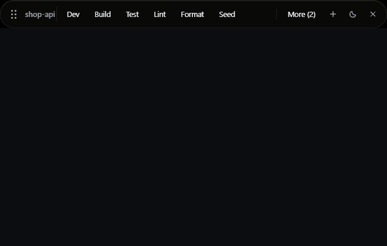
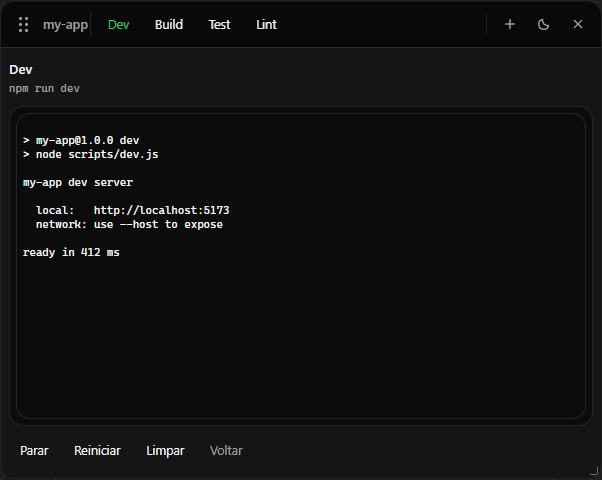
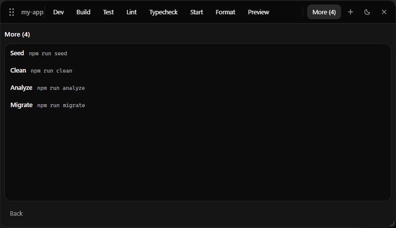
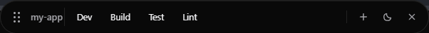
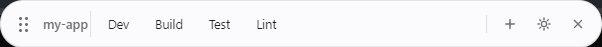
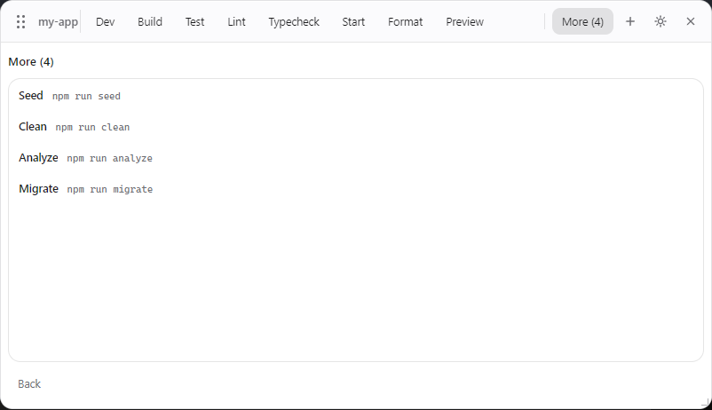
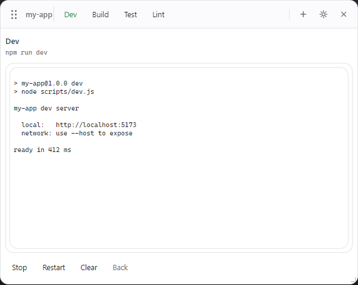

[English](README.md) | Português

# Dev Island

O Dev Island coloca os scripts do seu projeto Node.js numa pequena barra
flutuante sobre o VS Code. Você clica no script, acompanha a saída e continua
trabalhando.



Ele lê os `scripts` do seu `package.json` e transforma cada um num botão. Se
você trocar para outro projeto em outra janela do VS Code, a barra acompanha e
passa a mostrar os scripts daquele projeto.

É um aplicativo Electron independente, não uma extensão do VS Code.

Eu criei o Dev Island por uma preguiça bem simples: cansei de digitar os mesmos
scripts do npm e ficar trocando de terminal só para rodar dev, build ou test. A
ideia é deixar esses scripts a um clique e ganhar um pouco de tempo no dia a
dia.

## Beta

O Dev Island ainda está em beta. Hoje ele é feito para projetos Node.js, e o
suporte oficial é só para pastas com `package.json`.

Python, Maven, Gradle e outros tipos de projeto ainda estão em teste. O código
já tenta reconhecê-los, mas pode falhar ou não encontrar nada — não conte com
isso ainda.

O foco atual é Windows com VS Code.

## Requisitos

- Windows
- VS Code, com o terminal PowerShell integrado
- Node.js — a versão mínima é a do campo `engines` do
  [package.json](package.json) (hoje Node 18)
- npm

## Instalação

O Dev Island é distribuído por este repositório. Você clona, instala as
dependências e compila uma vez:

```bash
git clone https://github.com/williamosilva/dev-island.git
cd dev-island
npm ci
npm run build
```

Sem Git? Use **Code → Download ZIP**, extraia a pasta, abra um terminal nela e
rode os mesmos `npm ci` e `npm run build`.

O build importa: o `dist/` não fica no repositório e é justamente o que a CLI
carrega. Rode `npm run build` de novo depois de cada `git pull`.

Deixe a pasta num lugar fixo. O setup guarda o caminho absoluto dela, então se
você mover ou renomear depois, rode o `setup` de novo.

## Como usar

Rode o setup uma vez, dentro da pasta do Dev Island:

```bash
node bin/dev-island.js setup
```

O setup é feito uma única vez. Depois disso, o Dev Island funciona nos seus
projetos Node.js. Basta abrir um projeto no VS Code, iniciar um terminal
PowerShell integrado e a Island carrega os scripts daquele projeto.

O fluxo inteiro é:

1. clonar ou baixar o Dev Island;
2. `npm ci`;
3. `npm run build`;
4. `node bin/dev-island.js setup`, uma vez;
5. deixar a pasta onde está;
6. abrir qualquer projeto Node.js no VS Code;
7. abrir o terminal PowerShell integrado;
8. clicar nos scripts pela Island.

Você não roda `setup` em cada projeto, e não há nada para instalar
globalmente — o Dev Island não é publicado no npm e o comando `dev-island` não
entra no seu PATH. Sempre que precisar da CLI, chame por
`node bin/dev-island.js` a partir da pasta do Dev Island.

Clicar num script abre um terminal dentro da própria barra, onde você acompanha
a saída e pode parar ou reiniciar o processo.



Quando há mais scripts do que cabe na barra, os que sobram vão para o
`More (N)`.



Você também pode arrastar os botões para reordenar, e a ordem fica salva.

Se algum projeto precisar de uma sincronização manual, entre na pasta dele e
chame a CLI pelo caminho completo:

```bash
cd C:\dev\meu-app
node C:\ferramentas\dev-island\bin\dev-island.js init
```

## Seus próprios botões

O botão `+` adiciona um comando que não está no seu `package.json`. Ele pede
duas coisas — um **Name** (o rótulo) e um **Script** (o comando a rodar) — então
dá para deixar algo como `npx prisma studio` ou `docker compose up` a um
clique. Para remover, abra o terminal daquele botão e clique em **Delete**.

O Dev Island guarda esses botões num arquivo pequeno dentro do projeto:

```
<seu-projeto>/.dev-island/buttons.json
```

Ele tem a barra inteira: os scripts encontrados no `package.json`, os que você
adicionou à mão e a ordem em que você arrastou:

```json
{
  "buttons": [
    { "name": "Dev", "script": "npm run dev" },
    { "name": "Studio", "script": "npx prisma studio" }
  ]
}
```

É JSON simples, então dá para editar na mão. Versione o arquivo se os botões
fizerem sentido para o time inteiro, ou coloque `.dev-island/` no `.gitignore`
daquele projeto se forem só seus.

O tema, a posição e o tamanho da janela não ficam aí — são seus, não do
projeto, então moram em `%APPDATA%\dev-island`.

## Temas

O botão de sol/lua alterna entre os dois temas, e a sua escolha fica guardada.

| Escuro | Claro |
| --- | --- |
|  |  |
|  |  |

O terminal acompanha o tema também:



## Comandos principais

Todos rodam a partir da pasta do Dev Island, depois do build:

```bash
node bin/dev-island.js setup     # configuração inicial
node bin/dev-island.js start     # sobe em segundo plano
node bin/dev-island.js stop      # encerra
node bin/dev-island.js --help    # todos os comandos
```

Para desfazer o hook do PowerShell, rode
`node bin/dev-island.js remove-shell-integration`.

## Desenvolvimento

```bash
npm run lint
npm run typecheck
npm run test
npm run build
```

O `npm run dev` compila o lado Node, sobe o Vite e abre o Electron com recarga
automática da interface.

## Licença

MIT © William Oliveira Silva
